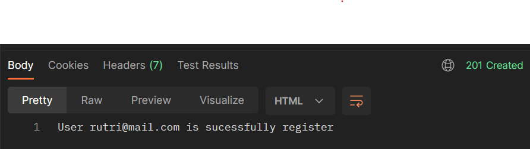

# BCR - Car Management Dashboard

Aplikasi web CRUD menggunakan express.js dan typescript untuk management data mobil. Aplikasi dibuat sebagai bagian dari challenge chapter 5, fullstack web development course di Binar Academy.

## Database

nama : db_car_rental

link : https://dbdiagram.io/d/654b34df7d8bbd6465bb8e45

## Dependencies

- cloudinary
- ejs
- express
- knex
- multer
- objection
- pg
- ts-node
- typescript
- uuid
- bcryptjs
-

Server app berjalan di port 8000 `http://localhost:8000/`

## Server Routing

### Tanpa Login

| Page          | Route          | Default Route                     | Http Method |
| ------------- | -------------- | --------------------------------- | ----------- |
| Register Page | `/user/signup` | http://localhost:8000/user/signup | Post        |
| Login Page    | `/user/signin` | http://localhost:8000/user/signin | Post        |

### Sebagai Member

| Page         | Route    | Default Route               | Http Method |
| ------------ | -------- | --------------------------- | ----------- |
| Get All Cars | `/cars/` | http://localhost:8000/cars/ | Get         |

### Sebagai Super Admin

| Page                   | Route          | Default Route                     | Http Method |
| ---------------------- | -------------- | --------------------------------- | ----------- |
| Get All Users          | `/manage/list` | http://localhost:8000/manage/list | Get         |
| Change member to admin | `/update/:id`  | http://localhost:8000//update/2   | Put         |

### Bisa diakses Super Admin dan Admin

| Page         | Route              | Default Route                       | Http Method |
| ------------ | ------------------ | ----------------------------------- | ----------- |
| Homepage     | `/cars/`           | http://localhost:8000/cars/         | Get         |
| Search Car   | `/cars/:id`        | http://localhost:8000/cars/1        | Get         |
| Form Add Car | `/cars/create`     | http://localhost:8000/cars/create   | Get         |
| Add Car      | `/cars/create`     | http://localhost:8000/cars/create   | Post        |
| Update Car   | `/cars/update/:id` | http://localhost:8000/cars/update/1 | Put         |
| Delete Car   | `/cars/:id`        | http://localhost:8000/cars/1        | Delete      |

## REST API Endpoints

### Tanpa Login

#### Register Page

Registrasi User Baru Sebagai Member

##### _HTTP Request_

> **POST**  
> `/user/signup`

#### _Default Request URL_

    http://localhost:8000/user/signup

#### _Expected Request_

Request Type: `application/json`  
Request Body:

    {
    	"emai": string,
    	"password": string,
    }

#### _Expected Response_

Response Code: `201`  
Response Type: `application/json`  
Response Body:

#### Login Page

Login Page

##### _HTTP Request_

> **POST**  
> `/user/signin`

#### _Default Request URL_

    http://localhost:8000/user/signin

#### _Expected Request_

Request Type: `application/json`  
Request Body:

    {
    	"emai": string,
    	"password": string,
    }

#### _Expected Response_

Response Code: `200`  
Response Type: `application/json`  
Response Body:

---

### Login Sebagai Member

#### Get All Car

Mengembalikan array berisi data mobil dari database. (ditampilkan di html/ejs)

##### _HTTP Request_

> **GET**  
> `/cars`

#### _Default Request URL_

    http://localhost:8000/api/cars

#### _Expected Response_

Response Code: `200`  
Response Type: `ejs`  
Response Body:

  

---

### Login Sebagai Super Admin dan Admin

#### Get All Car

Mengembalikan array berisi data mobil dari database. (ditampilkan di html/ejs)

##### _HTTP Request_

> **GET**  
> `/cars`

#### _Default Request URL_

    http://localhost:8000/api/cars

#### _Expected Response_

Response Code: `200`  
Response Type: `ejs`  
Response Body:

  

#### Get Car with ID

Mengembalikan data car berdasarkan dengan ID.

##### _HTTP Request_

> **GET**  
> `/cars/details/:id`

##### _Default Request URL_

    http://localhost:8000/cars/details/1

##### _Expected Response_

Response Code: `200`  
Response Type: `ejs`  
Response Body:

  

---

#### Add New Car

Menambahkan data mobil baru ke database.

##### _HTTP Request_

menampilkan form isi data mobil _masih belum berhasil menambahkan dari front end_

> **GET**  
> `/cars/create`

##### _Default Request URL_

    http://localhost:8000/cars/create

##### _Expected Response_

Response Code: `200`
Response Type: `ejs`  
Response Body:

  

##### _HTTP Request_

> **POST**  
> `/cars/create`

##### _Default Request URL_

    http://localhost:8000/cars/create

##### _Expected Request_

Request Type: `application/json`  
Request Body:

    {
        "id": number,
    	"name": string,
    	"rent": number,
    	"picture": file,
    	"type": number // id yang ada di tabel type
    }

##### _Expected Response_

Response Code: `201`  
Response Type: `application/json`  
Response Body:

  

---

#### Edit Car Data with ID

Mengedit data car berdasarkan ID.

##### _HTTP Request_

> **PUT**  
> `/cars/update/:id`

##### _Default Request URL_

    http://localhost:8000/cars/update/1

##### _Expected Request_

Request Type: `application/json`  
Request Body:

    {
    	"name": string, <optional>
    	"rent": number, <optional>
    	"picture": file, <optional>
    	"type": number // id yang ada di tabel type <optional>
    }

##### _Expected Response_

Response Code: `200`  
Response Type: `application/json`  
Response Body:

  

---

#### Delete Car with ID

Menghapus data car berdasarkan ID.

##### _HTTP Request_

> **DELETE**  
> `/cars/:id`

##### _Default Request URL_

    http://localhost:8000/cars/1

##### _Expected Response_

Response Code: `200`  
Response Type: `application/json`  
Response Body:

  

---
